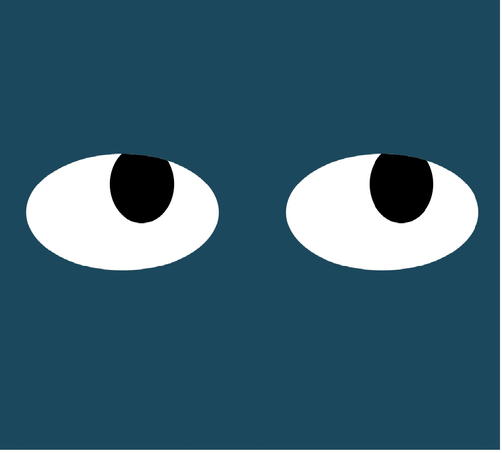

# EyeMovement

>Proyecto para mover los ojos en sincronía con el movimimento del mouse en la pantalla del dispositivo
>> Al mover el mouse los ojos le siguen su trayectoria

---


---

<div align="center" id="top"> 
  
  &#xa0;
</div>

<h1 align="center">0108-EyeMovement</h1>

<p align="center">
  

  

  

  
</p>


<p align="center">
  <a href="#dart-about">Acerca</a> &#xa0; | &#xa0; 
  <a href="#sparkles-features">Caracteristicas</a> &#xa0; | &#xa0;
  <a href="#rocket-technologies">Tecnologías</a> &#xa0; | &#xa0;
  <a href="#white_check_mark-requirements">Requerimientos</a> &#xa0; | &#xa0;
  <a href="#checkered_flag-starting">Instrucciones</a> &#xa0; | &#xa0;
  <a href="#memo-license">Licencia</a> &#xa0; | &#xa0;
  <a href="https://github.com/betoje" target="_blank">Autor</a>
</p>

<br>

## :dart: Acerca ##

Proyecto para mover los ojos en sincronía con el movimimento del mouse en la pantalla del dispositivo.

## :sparkles: Caracteristicas ##

:heavy_check_mark: Los cambios en el movimiento de los ojos se realizan manipulando elementos del DOM con JavaScript. 

## :rocket: Tecnologias ##

Los siguientes lenguajes/herramientas fueron usados en este proyecto:

- JavaScript, HTML, CSS

## :white_check_mark: Requerimientos ##

Antes de empezar :checkered_flag:, se necesita tener [Git](https://git-scm.com) instalado.

## :checkered_flag: Instrucciones ##

```bash
# Clone este proyecto (desde la terminal)
$ git git@github.com:betoje/0108-EyeMovement.git

# Acceda al directorio
$ cd 0108-EyesMovement

# Arrastre el archvo index.html a su navegador de elección.
```

## :memo: Licencia ##

Este proyecto está bajo la licencia de MIT. Para mayores detalles vea el archivo [LICENSE](LICENSE).

Hecho con :heart: por <a href="https://github.com/betoje" target="_blank">Alberto Jacome</a>&#xa0;

<a href="#top">Regresar al inicio</a>